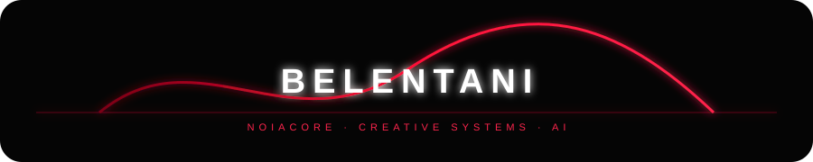

 

  

---

## ◉ BELENTANI

**Pedro Belentani** — AI systems builder, creative technologist and full-stack engineer based in Barcelona.

I build things where **software, artificial intelligence, automation, design and culture** stop behaving like separate disciplines.

> **Not just applications. Living systems.**

---

## ⚡ WHAT I BUILD

<table>
<tr>
<td width="50%">

### 🧠 AI & AGENTS
- Multi-agent systems
- AI orchestration
- Agent tooling & skills
- LLM integrations
- Automation pipelines
- AI-native products

</td>
<td width="50%">

### 🎛 CREATIVE TECHNOLOGY
- Generative media
- Interactive experiences
- Music / artist systems
- Visual interfaces
- Creative automation
- Experimental web

</td>
</tr>
<tr>
<td>

### 🏗 ENGINEERING
- TypeScript / Python
- Next.js / React
- FastAPI
- Three.js
- APIs & integrations
- Vercel / Cloudflare

</td>
<td>

### 🌍 HUMAN SYSTEMS
- Education platforms
- Migrant support
- Accessible AI
- Digital products
- Open-source experiments
- Community infrastructure

</td>
</tr>
</table>

---

## 🔴 NOIACORE

**NOIACORE** is the systems layer behind the work.

> **Inteligencia silenciosa. Tecnología esencial.**

AI systems · automation · agents · diagnostics · creative technology.

[→ Explore NOIACORE](https://github.com/belentani7/NOIACORE)

---

## 🧬 SELECTED SYSTEMS

| PROJECT | WHAT IT IS |
|---|---|
| **[NOIACORE](https://github.com/belentani7/NOIACORE)** | Multi-agent intelligence system |
| **[agent-skills](https://github.com/belentani7/agent-skills)** | 311 CLI agent skills - MIT |
| **[secure-t](https://github.com/belentani7/secure-t)** | Cybersecurity + AI digital university |
| **[open-school](https://github.com/belentani7/open-school)** | Universal digital education institute |
| **[pvc-u-core](https://github.com/belentani7/pvc-u-core)** | Governance kernel for autonomous AI companies |
| **[agentguard](https://github.com/belentani7/agentguard)** | AI budget guardrails & agent auto-pause |
| **[system-one-unified](https://github.com/belentani7/system-one-unified)** | Typed, deterministic offline decision engine |
| **[belent-cad](https://github.com/belentani7/belent-cad)** | Open-source architectural CAD |
| **[Belentani.cv-ai](https://github.com/belentani7/Belentani.cv-ai)** | AI document studio - CV, GDPR, AES-256 |
| **[Cruzando el Charco](https://github.com/belentani7/Cruzando-el-charco)** | Social-impact platform for migrant LGBT+ people |

---

## RADAR 2026

> Field notes 2026 - what I actually build with, not what is trending.

| DOMAIN | NOW (2026) |
|---|---|
| Agentic coding | CLI agents (OpenCode, Claude Code, Cursor, Kilo) + MCP tool servers |
| Agent infra | Multi-agent orchestration, subagents, skill routers, guardrails & budgets |
| Web UI | React 19 + signals, Tailwind v4, view transitions, shadcn/ui |
| 3D / creative | Three.js r185 WebGPU/TSL, GSAP, procedural generation |
| Backend | FastAPI + SQLModel, PostgreSQL/Neon, Redis/BullMQ, JWT/OAuth |
| Data / AI | RAG with local vectors, local-first + offline, LiteLLM routing |
| Deploy | Vercel + Cloudflare Workers/R2, GitHub Actions CI |
| Docs | Spec-driven: PRD -> SRS -> SDD -> ADR -> Plan before any code |

## OPEN SOURCE STANDARD

Every active repo I audit ships the same documentation baseline:
`AGENTS.md` + `.cursorrules` + `docs/prd` + `docs/srs` + `docs/design` + `docs/adr` + `docs/plans`.

> Documents rule, code obeys. Evidence over promises. Free-first.

## 🛰 CURRENTLY BUILDING

<pre>
◉ AI SYSTEMS
◉ AGENT INFRASTRUCTURE
◉ CREATIVE AI
◉ AUTOMATION
◉ EDUCATION
◉ DIGITAL EXPERIENCES
◉ OPEN SOURCE
</pre>

### THE STACK

---

## 📡 SIGNAL

 

---

## 🌐 EDUCATION & SOCIAL IMPACT

### ManosAbiertas
Free digital education for migrants and Latin American communities.

**AI · Office · CV building · digital skills**

### Other platforms
**Secure T University · open-school · UX Academy · Aprende Brasil**

Built around the idea that technology becomes more valuable when it can be **understood, accessed and used by more people**.

---

## 🩸 BELENTANI / OMEGA

There is also another side of the system.

**Music · visual identity · narrative · AI · interactive worlds**

[belentani_Omega](https://github.com/belentani7/belentani_Omega)

> Code can be infrastructure.  
> Music can be infrastructure.  
> Images can be infrastructure.  
> A world can be infrastructure.

---

## 🧪 EXPERIMENTAL MODE

<pre>
+ building
+ breaking
+ rebuilding
+ automating
+ composing
+ researching
+ shipping
</pre>

I like systems that feel **alive** rather than finished.

---

### ─────────────────────────────────

**BELENTANI**

AI SYSTEMS · CREATIVE TECH · FULL-STACK

[GitHub](https://github.com/belentani7) · [NOIACORE](https://github.com/belentani7/NOIACORE)

 

  

NOIACORE · 2026 · Barcelona

