<!-- ANIMATED NEON BANNER (generado por scripts/banner-gen.js — SMIL, sin JS) -->

 

---

## 🔴 LA EXPERIENCIA COMPLETA

> GitHub **sanitiza** `<script>` y `<style>` en los README — la experiencia WebGL completa vive en su propio planeta, el banner SVG animado de arriba es su proyección 2D:

<a href="https://belentani-experience.vercel.app" style="display:inline-block; background:#ff073a; color:#000; font-weight:bold; padding:12px 28px; border-radius:8px; text-decoration:none; letter-spacing:2px; font-family:monospace;">🚀 ENTRAR EXPERIENCIA 3D (NEURAL CORE)</a>

Núcleo rojo neón · WebGL particles · Bloom + Chromatic Aberration · scroll cinematográfico

---

## 📊 TELEMETRÍA DEL NÚCLEO

 

 

---

## 🧬 ECOSISTEMAS ACTIVOS

> Un solo operador neural, múltiples universos — cada uno con su propia estética y lógica.

<table>
<tr>
  <td align="center" style="border:1px solid #ff073a33; padding:14px; background:#0a0a0a;">
    <a href="https://belentani.vercel.app" style="text-decoration:none;"><b style="color:#ff073a;">NOIACORE LAB</b> 
    creative + educational platforms 
    🔴 Live</a>
  </td>
  <td align="center" style="border:1px solid #ff073a33; padding:14px; background:#0a0a0a;">
    <a href="https://belentani7.github.io/heyduck/" style="text-decoration:none;"><b style="color:#ff073a;">DUCK</b> 
    music · apps · studio tools 
    🟢 Módulos</a>
  </td>
  <td align="center" style="border:1px solid #ff073a33; padding:14px; background:#0a0a0a;">
    <a href="https://judas-experience-13898.buildaispace.app/" style="text-decoration:none;"><b style="color:#ff073a;">JUDAS</b> 
    estética cristal sangrante 
    🔴 Storyboard</a>
  </td>
  <td align="center" style="border:1px solid #ff073a33; padding:14px; background:#0a0a0a;">
    <a href="https://belentani.vercel.app" style="text-decoration:none;"><b style="color:#ff073a;">OMEGA</b> 
    artist ecosystem 
    🔴 Live</a>
  </td>
</tr>
<tr>
  <td align="center" style="border:1px solid #ff073a33; padding:14px; background:#0a0a0a;">
    <a href="https://belentani7.github.io/secure-t/" style="text-decoration:none;"><b style="color:#ff073a;">secure-t</b> 
    cyber + AI university 
    🔴 Web</a>
  </td>
  <td align="center" style="border:1px solid #ff073a33; padding:14px; background:#0a0a0a;">
    <a href="https://belentani-experience.vercel.app" style="text-decoration:none;"><b style="color:#ff073a;">nexus-os</b> 
    neon glass OS · 38+ apps 
    ⚫ Expo</a>
  </td>
  <td align="center" style="border:1px solid #ff073a33; padding:14px; background:#0a0a0a;">
    <a href="https://manosabiertas-seven.vercel.app" style="text-decoration:none;"><b style="color:#ff073a;">ManosAbiertas</b> 
    educación + migración 
    🔴 Web</a>
  </td>
  <td align="center" style="border:1px solid #ff073a33; padding:14px; background:#0a0a0a;">
    <a href="http://www.belentani.es/" style="text-decoration:none;"><b style="color:#ff073a;">CARQUIDEC</b> 
    arquitectura paramétrica 
    🔴 ES/EU</a>
  </td>
</tr>
</table>
⚠️ Los botones apuntan a <b>webs</b> (deployments), no a repositorios — el código vive en GitHub, la experiencia en la web.

---

## ⚡ TECH ARSENAL

<table>
<tr>
  <td width="33%" style="border:1px solid #ff073a33; padding:12px; background:#0a0a0a;">
    <b style="color:#ff073a;">CORE SYSTEMS</b> 
    <code>TypeScript</code> <code>Python</code> <code>Java</code> <code>Go</code> <code>PowerShell</code>
  </td>
  <td width="33%" style="border:1px solid #ff073a33; padding:12px; background:#0a0a0a;">
    <b style="color:#ff073a;">WEB / FRAMEWORKS</b> 
    <code>React 19</code> <code>Next.js 16</code> <code>Astro</code> <code>Vite</code> <code>tRPC</code>
  </td>
  <td width="34%" style="border:1px solid #ff073a33; padding:12px; background:#0a0a0a;">
    <b style="color:#ff073a;">DATA / INFRA</b> 
    <code>Drizzle</code> <code>MySQL</code> <code>Redis</code> <code>Express</code> <code>Docker</code>
  </td>
</tr>
<tr>
  <td style="border:1px solid #ff073a33; padding:12px; background:#0a0a0a;">
    <b style="color:#ff073a;">3D / MOTION</b> 
    <code>Three.js</code> <code>R3F</code> <code>GSAP</code> <code>Lenis</code> <code>Framer</code>
  </td>
  <td style="border:1px solid #ff073a33; padding:12px; background:#0a0a0a;">
    <b style="color:#ff073a;">AI / AUDIO</b> 
    <code>RVC</code> <code>Applio</code> <code>Whisper</code> <code>Demucs</code> <code>Tone.js</code>
  </td>
  <td style="border:1px solid #ff073a33; padding:12px; background:#0a0a0a;">
    <b style="color:#ff073a;">AGENT TOOLS</b> 
    <code>Claude Code</code> <code>Qwen Code</code> <code>Aider</code> <code>OpenCode</code>
  </td>
</tr>
</table>

---

## 🎯 ACTIVE MISSIONS

> Verdadero desde las misiones del banner y los repos más recientes.

| Project | Stack | Status |
|---------|-------|--------|
| 🔴 **NOIACORE LAB** | `React 19` `tRPC` `LLM` `MySQL` | 298 files · Live |
| 🔴 **meta-skill** | `Python` `Zero-token routing` | 16 archetypes |
| 🔴 **AgentGuard** | `Go` `Budget firewall` | Auto-pause daemon |
| 🔴 **nexus-os** | `JS` `Neon Glass OS` | 38+ apps · zero deps |
| 🟠 **Voice Clone** | `RVC` `Applio` `Kaggle GPU` | 47 stems training |
| 🔴 **Evidence Ledger** | `TS` `Audit trail` | Cryptographic |
| 🔴 **proofmesh** | `TS` `Change intelligence` | 6-criteria gates |
| 🟠 **gpu-cost-optimizer** | `Python` `Diffusion` | -70% cost |

---

## 🌐 PORTALES DE ACCESO

<table>
<tr>
  <td align="center" style="border:1px solid #ff073a33; padding:16px; background:#0a0a0a;">
    <b style="color:#ff073a;">MAIN SITE</b> 
    <a href="https://belentani.vercel.app">belentani.vercel.app</a>
  </td>
  <td align="center" style="border:1px solid #ff073a33; padding:16px; background:#0a0a0a;">
    <b style="color:#ff073a;">EXPERIENCIA 3D</b> 
    <a href="https://belentani-experience.vercel.app">belentani-experience</a>
  </td>
  <td align="center" style="border:1px solid #ff073a33; padding:16px; background:#0a0a0a;">
    <b style="color:#ff073a;">JUDAS EXP.</b> 
    <a href="https://judas-experience-13898.buildaispace.app/">buildaispace</a>
  </td>
  <td align="center" style="border:1px solid #ff073a33; padding:16px; background:#0a0a0a;">
    <b style="color:#ff073a;">ES / EU</b> 
    <a href="http://www.belentani.es/">belentani.es</a>
  </td>
  <td align="center" style="border:1px solid #ff073a33; padding:16px; background:#0a0a0a;">
    <b style="color:#ff073a;">LINKEDIN</b> 
    <a href="https://linkedin.com/in/pedro-b-09473598">pedro-b</a>
  </td>
</tr>
</table>

---

> `$ echo $LOC:` **Barcelona · L'Hospitalet (n. São Paulo)**
> `$ echo $LANG:` **TypeScript 66% · HTML 12% · JS 12% · Python 6%**

*"Fazer visível o que importa."* — [belentani.vercel.app](https://belentani.vercel.app)

