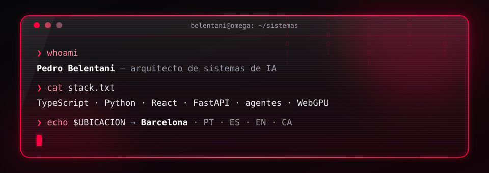

  

# Pedro Belentani

**AI systems · product engineering · creative technology**

I build practical software around AI agents, local-first workflows, automation, accessible products and interactive experiences. My public GitHub is intentionally being reduced to canonical projects: fewer repositories, clearer ownership, stronger documentation.

[Portfolio · belentani.es](https://belentani.es) · [Contact](mailto:belentani7pedro@gmail.com)

## Selected engineering work

| Project | What it demonstrates |
|---|---|
| [**agent-skills**](https://github.com/belentani7/agent-skills) | Curated registry of **311 agent skills** with installers for multiple coding-agent CLIs. |
| [**open-school**](https://github.com/belentani7/open-school) | Offline-first, accessible React education platform with explicit privacy and implementation boundaries. |
| [**agentguard**](https://github.com/belentani7/agentguard) | Guardrails for AI-agent spending, limits and overflow routing. |
| [**agentbox**](https://github.com/belentani7/agentbox) | Disposable isolated environments for coding agents; cloud/sandbox tooling. |
| [**comfyui-json-compiler**](https://github.com/belentani7/comfyui-json-compiler) | Python compiler from creative briefs to validated ComfyUI workflow JSON. |
| [**llm-vfx-orchestrator**](https://github.com/belentani7/llm-vfx-orchestrator) | LLM-driven VFX orchestration with ComfyUI and an automated QA/correction loop. |
| [**belent-cad**](https://github.com/belentani7/belent-cad) | React/Three.js architectural CAD experiment for sketch-to-3D workflows. |
| [**oss-compass**](https://github.com/belentani7/oss-compass) | Small validation system exploring auditable multi-node confirmation. |

## Product, accessibility and public-interest work

- [**Cruzando el Charco**](https://github.com/belentani7/Cruzando-el-charco) — multilingual, accessible Barcelona/Sitges resource guide with offline support and privacy-oriented design.
- [**ManosAbiertas**](https://github.com/belentani7/ManosAbiertas) — free practical education and CV resources for migrants and newcomers.
- [**Harmonia Hub**](https://github.com/belentani7/harmonia-hub) — React Native / Expo coordination and wellbeing product.
- [**WILLIAMSCHOOL**](https://github.com/belentani7/WILLIAMSCHOOL) — community education project.

## Creative technology

- [**The Judas Experience**](https://github.com/belentani7/judas-experience-web) — procedural Three.js experience with production-oriented specs and CI.
- [**Belentani Omega**](https://github.com/belentani7/belentani_Omega) — central node for the Belentani artistic/interactive ecosystem.
- [**Duck Ecosystem**](https://github.com/belentani7/duck-ecosystem) — orchestration layer connecting music-production tools without rewriting their original systems.
- [**Duck Studio Suite**](https://github.com/belentani7/duck-studio-suite) — browser-based music-production tools.

## How I build

I prefer systems that are inspectable and recoverable: explicit boundaries, local-first/offline-first when useful, minimal personal-data collection, clear quickstarts, reproducible builds, security checks and accessible interfaces. I use AI as an engineering component, not as a substitute for product architecture.

## Stack

**TypeScript · React · Next.js · Node.js · Python · Go · Java · Spring Boot · Three.js · Vite · FastAPI · Docker**

Current areas of focus: **AI agents, orchestration, developer tooling, creative AI pipelines, local-first software, accessibility and interactive web systems.**
